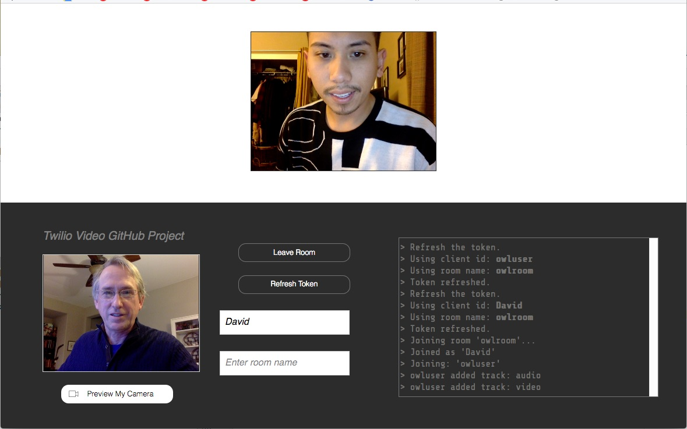

# owlvideo
A Twilio Video Web Client which calls a Twilio Function to get an access token.

Requirements:

- Twilio account. A free Trial account will work.
- NodeJS installed to run the Client locally on your computer.
Or a website that runs PHP programs. PHP is very common with service providers.

Note, this sample is a variation of the [Video Quickstart PHP](https://github.com/kedartoraskar/video-quickstart-php) GitHub project.

Screen print:

## Files

The Client files:
- [index.html](index.html) : Twilio JavaScript (JS) Client to join video rooms.
- [video.css](video.css) : the Client HTML object styles

The server files:
- [httpVideoServer.js](httpVideoServer.js) : a NodeJS HTTP Server that serves the Client files and calls generateVideoToken.js.
This is used to run the Twilio Client locally on a computer.
- [getToken.php](getToken.php) : a program that calls generateVideoToken.js and return a token.
This is used when hosting the Twilio Client remotely on a public PHP website.

Twilio NodeJS Functions
- [generateVideoToken.js](generateVideoToken.js) : generate and return a video room access token.

Heroku Hosting Service
- [app.json](app.json) : Heroku deployment file to describe the application.
- [composer.json](composer.json) : Heroku deployment file which sets the programming language used.

## Implementation

The server side can run locally on a computer using NodeJS, or run on a website that runs PHP programs.

1. [Local Server Side Setup using a NodeJS Webserver](#bullet1)
2. [Remote Server Side Setup using a PHP Webserver](#bullet2)
3. [Add a Twilio Function](#bullet3)
4. [Create API Key and secret key string](#bullet4)
5. [Twilio Function Configuration](#bullet5)
6. [Testing](#bullet6)

### Local Server Side Setup using a NodeJS Webserver

Download the project zip file.

    https://github.com/tigerfarm/owlvideo

1. Click Clone or Download. Click Download ZIP.
2. Unzip the file into a work directory.
3. Change into the unzipped directory: owlvideo-master.

Install the NodeJS "request" module:
    
    $ npm install request

Run the NodeJS HTTP server.

    $ node httpVideoServer.js
    +++ Start: httpVideoServer.js
    Static file server running at
      => http://localhost:8000/
    CTRL + C to shutdown
    ...
    
Use a browser to access the Twilio Client:

    http://localhost:8000/index.html

### Remote Server Side Setup using a PHP Webserver

Download the project zip file. Unzip the file into your website's CGI bin directory, or in any directory that will automatically run clientTokenGet.php as PHP program when called from HTTP. Test by displaying the Client in your browser, example URL:

    https://example.com/cgi/index.html

### Add a Twilio Function

You will need to replace the sample domain name, "about-time-6360.twil.io," with your Runtime Domain name.
You can view your Runtime Domain name at this link:

[https://www.twilio.com/console/runtime/overview](https://www.twilio.com/console/runtime/overview)

Create a Twilio Function to generate client capability tokens.
In Twilio Console, go to:

    https://www.twilio.com/console/runtime/functions
    
1. Click the Create Function icon (circle with plus sign in the middle).
2. Click Blank. Click Create.
   - Properties, Function Name: Generate Video Access Token
   - URL: https://about-time-6360.twil.io /tokenvideo
   - Uncheck Configuration, Access Control to allow Twilio JS Client access.
   - Copy and paste the contents of [tokenvideo.js](tokenvideo.js) into the Code box.
3. Click Save.

### Create an API key and secret key string

In Twilio Console, go to:

    [https://www.twilio.com/console/voice/runtime/api-keys](https://www.twilio.com/console/voice/runtime/api-keys)
    https://www.twilio.com/console/voice/runtime/api-keys/create
    Friendly name: owlvideo
    API key SID: SKxxxxxxxxxxxxxxxxxxxxxxxxxxxxxx
    API key Secret: yyyyyyyyyyyyyyyyyyyyyyyyyyyyyyyyy

In a following step, the API key SID and Secret are added as Twilio Functions environment variables.
Note, the  account SID, API key and secret are the authentication keys. They must be from the same account or subaccount (not a combination of each).

### Twilio Function Configuration

Configure your account's Twilio Functions settings.
In Twilio Console, go to:
    
    https://www.twilio.com/console/runtime/functions/configure
    
Check: Enable ACCOUNT_SID and AUTH_TOKEN.
- This allows your Functions to access your account SID and auth token as environment variables.

Create Function Environment Variables.

    (Key : value)
    CLIENT_ID : Example, owluser (Your default Client identity attribute, no spaces)
    ROOM_ID : Example, owlroom (a default room name attribute, no spaces)
    
    VOICE_API_KEY : SKxxxxxxxxxxxxxxxxxxxxxxxxxxxxxx (SK value created above)
    VOICE_API_SECRET : yyyyyyyyyyyyyyyyyyyyyyyyyyyyyyyyy (secret key string value created above)
    
    Click Save, to save the environment variables.

Test by generating an access token in your browser (Use your own Twilio Function domain):

    https://about-time-1235.twil.io/tokenVideo

Example response (note this is not actual token):

    eyKsbGciOiJIUzI1NiIsInR5cNE8KkpXVCIsImN0eSI6InR3aWxpby1mcGE7dj0xIn0.eyJqdGkiOiJTS2YwMjM1OTg2ZjRkNDMzYzMzOGI2NzExNTNiMzQxYTFmLNA8KEk5NTIxODkiLCJncmFudHMiOnsiaWRlbnRpdHkiOiJvd2x1c2VyIiwidmlkZW8iOnsicm9vbSI6Im93bHJvb20ifX0sImlhdCI6MTUxOTk1MjE4OSwiZXhwIjoxNTE5OTU1Nzg5LCJpc3MiOiJTS2YwOnS1OTg2ZjRkNDMzYzMzOGI2NzExNTNiMzQxYTFmIiwic3ViIjoiQUMxYjMyNDE0ZThhYjQxKSJ2ZTYzOTNiY2JiYTdkNWE5ZCJ9.W7jenDR5EZiO0KSENaeF1i5xbLxQTM0qfVRykKkw9

Update your Twilio Function host name into the Twilio Client server side programs.
You can view the host name by going to the following link. The host name, is Your Runtime Domain name:

    https://www.twilio.com/console/runtime/overview

    If you are using the NodeJS webserver, edit: httpVideoServer.js.
    If you are using a remote webserver with PHP, edit: getToken.php.
    Change:
       tokenHost = "about-time-1235.twil.io";
    to use your Twilio Function host name.
    
    If you are running httpVideoServer.js. Restart it.

## Testing

If running locally, use a browser to access the Twilio Client:

    http://localhost:8000/index.html

If on a website, use a browser to access the website Twilio Client URL, example:

    http://example.com/cgi/index.html
    
Click the Refresh button. The Client's room access token is refreshed.

Enter your first name where it says, "Enter client id." Click the Refresh button and the token is refreshed with your name.

Enter a room name where it says, "Enter room name." Click the Refresh button and the token is refreshed with your name and your room name.

Click Preview My Camera. Video starts up.

Click Join Room. You will join your room, using your name. Join Room, uses the refreshed token.

Ask someone else to join.

Cheers...
